# StellarEscrow 🏠

[](https://github.com/swagcodes23/stellarescrow/actions/workflows/ci.yml)

**StellarEscrow** is a fully decentralized, full-stack application for managing rental security deposits. Built with a React frontend and powered by Soroban smart contracts on the Stellar network, this dApp provides a secure, trustless, and immutable way to lock and release rental deposits between landlords and tenants.

🔗 **Live Demo:** https://stellarescrow.vercel.app/

---

## Table of Contents

- [Project Description](#project-description)
- [Architecture & Inter-Contract Communication](#architecture--inter-contract-communication)
- [Features](#features)
- [Tech Stack](#tech-stack)
- [Project Structure](#project-structure)
- [Getting Started](#getting-started)
- [Smart Contract Details](#smart-contract-details)
- [Testing](#testing)
- [CI/CD Pipeline](#cicd-pipeline)
- [Error Handling & Loading States](#error-handling--loading-states)
- [Mobile Responsiveness](#mobile-responsiveness)
- [Deployment](#deployment)
- [Screenshots](#screenshots)
  - [Application UI (Desktop)](#️-application-ui-desktop)
  - [Mobile UI](#-mobile-ui)
  - [Test Output](#-test-output)
  - [CI/CD Pipeline](#️-cicd-pipeline)

---

## Project Description

**StellarEscrow** eliminates the friction and lack of trust in traditional rental agreements. Instead of handing a cash deposit directly to a landlord, funds are locked in a Soroban smart contract on the Stellar blockchain. The deposit remains securely in escrow and is only released when both parties agree or predefined contract conditions are met, taking advantage of Stellar's fast finality and minimal transaction fees.

## Architecture & Inter-Contract Communication

This project implements a multi-contract architecture on Soroban with inter-contract communication between the Escrow contract and the Stellar Asset Contract (SAC):

```mermaid
graph TB
    subgraph Frontend["React Frontend"]
        UI[User Interface]
        FR[Freighter Wallet]
        AL[Albedo Wallet]
        SDK[Stellar SDK / Soroban RPC]
    end

    subgraph Soroban["Soroban Smart Contracts"]
        EC[Escrow Contract<br/>deposit / release / refund<br/>get_status / get_amount]
        SAC[Stellar Asset Contract<br/>Native XLM Token]
    end

    subgraph Events["Event Streaming"]
        EV[Contract Events]
        POLL[Polling via getEvents API]
    end

    UI -->|Connect| FR
    UI -->|Connect| AL
    UI -->|Sign & Submit Tx| SDK
    SDK -->|Invoke| EC
    EC -->|"Inter-contract call:<br/>token::Client::transfer()"| SAC
    EC -->|Emit Events| EV
    EV -->|Poll every 5s| POLL
    POLL -->|Update| UI
```



### Inter-Contract Communication Details

The Escrow contract communicates with the **Stellar Asset Contract (SAC)** using the `soroban_sdk::token::Client`. This is a real cross-contract invocation on-chain:

- **`deposit()`** → Calls `token_client.transfer(&tenant, &contract_address, &amount)` — transfers tokens from the tenant into the escrow contract
- **`release()`** → Calls `token_client.transfer(&contract_address, &landlord, &amount)` — releases held tokens to the landlord
- **`refund()`** → Calls `token_client.transfer(&contract_address, &tenant, &amount)` — refunds held tokens back to the tenant

Each of these is an **inter-contract invocation** where the Escrow contract calls the Token contract to move funds.

## Features

- **Connect Wallet:** Seamlessly authenticate using either **Freighter** or **Albedo** browser wallets
- **Initiate Escrow:** Tenants can deposit testnet XLM into the smart contract
- **View Balances:** Real-time querying of the connected wallet's balance
- **Release/Refund Mechanisms:** Programmatic contract calls to release or refund deposits
- **Real-Time Event Feed:** Live polling of contract events with auto-refresh every 5 seconds
- **Error Boundary:** Application-wide error handling prevents crashes from propagating
- **Loading States:** Animated spinners and status alerts during transaction processing
- **Mobile Responsive:** Fully responsive UI across desktop, tablet, and mobile

## Tech Stack

| Layer | Technology |
|-------|------------|
| **Frontend** | React.js 19, JavaScript, Tailwind CSS v3 |
| **Smart Contract** | Rust, Soroban SDK v25 |
| **Network** | Stellar Testnet |
| **Wallet** | Freighter Extension + Albedo Web Wallet |
| **CI/CD** | GitHub Actions |
| **Testing** | Rust `cargo test`, React Testing Library, Jest |
| **Development** | Create React App, Node.js 18+ |

## Project Structure

```text
.
├── .github/workflows/
│   └── ci.yml                  # CI/CD pipeline (Rust tests + Frontend build)
├── src/                        # React Frontend Application
│   ├── components/
│   │   ├── Header.js           # Responsive navigation & wallet connection
│   │   ├── Header.test.js      # Header component tests
│   │   ├── EscrowInteraction.js # Deposit/Release/Refund UI with loading states
│   │   ├── EscrowInteraction.test.js # Escrow component tests
│   │   ├── EventFeed.js        # Real-time event streaming via Soroban RPC
│   │   ├── ErrorBoundary.js    # Application error boundary
│   │   ├── Freighter.js        # Freighter wallet utilities
│   │   ├── Albedo.js           # Albedo wallet utilities
│   │   ├── Soroban.js          # Contract invocation layer
│   │   └── SendPayment.js      # Direct XLM payment utility
│   ├── config.js               # Centralized environment configuration
│   ├── App.js                  # Root component with ErrorBoundary
│   ├── App.test.js             # App-level integration tests
│   ├── App.css                 # Custom animations
│   └── index.js                # Entry point
├── my-soroban-contract/        # Soroban Smart Contracts Workspace
│   ├── contracts/
│   │   └── hello-world/        # Escrow smart contract
│   │       ├── src/
│   │       │   ├── lib.rs      # Core escrow logic (deposit, release, refund, get_status)
│   │       │   └── test.rs     # 6 comprehensive Rust unit tests
│   │       └── Cargo.toml
│   └── Cargo.toml              # Workspace configuration
├── .env.example                # Environment variable template
├── package.json
├── tailwind.config.js
└── README.md
```

## Getting Started

### Prerequisites

- **Node.js** 22+ (recommended: 24) and **npm**
- **Rust** and **Cargo** (with `wasm32-unknown-unknown` target)
- **Stellar CLI** (`stellar`)
- **Freighter Wallet** browser extension ([install](https://www.freighter.app/)) switched to **Testnet**

### Installation

```bash
# Clone the repository
git clone https://github.com/swagcodes23/stellarescrow.git
cd stellarescrow

# 1. Start the Frontend
npm install
npm start
# Opens http://localhost:3000

# 2. Build the Smart Contract
cd my-soroban-contract
stellar contract build
```

### Environment Setup

```bash
# Copy the environment template
cp .env.example .env
# Edit .env with your contract addresses and network config
```

## Smart Contract Details

The Soroban smart contract handles the secure holding of funds with full state management and inter-contract token operations.

| Method | Auth | Description |
|--------|------|-------------|
| `deposit` | ✅ Tenant auth | Locks the rental deposit into the contract via SAC `transfer()` |
| `release` | ✅ Landlord auth | Releases the deposit to the landlord via SAC `transfer()` |
| `refund` | ✅ Landlord auth | Refunds the deposit back to the tenant via SAC `transfer()` |
| `get_status` | ❌ Public | Returns escrow state: 0=Uninitialized, 1=Locked, 2=Released, 3=Refunded |
| `get_amount` | ❌ Public | Returns the locked deposit amount (or 0 if none) |

### Contract Events

The contract emits events for every state transition:

| Event Topic | Payload | When |
|-------------|---------|------|
| `("escrow", "deposit")` | `(tenant, landlord, amount)` | Deposit is locked |
| `("escrow", "release")` | `landlord` | Funds released to landlord |
| `("escrow", "refund")` | `tenant` | Funds refunded to tenant |

### Error Handling

| Error Code | Name | Description |
|------------|------|-------------|
| 1 | `AlreadyDeposited` | Deposit already exists (state is Locked) |
| 2 | `NotAuthorized` | Caller is not the registered landlord |
| 3 | `InvalidState` | Operation invalid for current state |

## Testing

### Smart Contract Tests (Rust)

The contract includes **6 comprehensive unit tests**:

```bash
cd my-soroban-contract
cargo test --verbose
```

| Test | Description |
|------|-------------|
| `test_deposit` | Verifies deposit locks funds correctly |
| `test_double_deposit_fails` | Ensures duplicate deposits are rejected |
| `test_release` | Verifies funds transfer to landlord |
| `test_refund` | Verifies funds return to tenant |
| `test_release_wrong_state` | Tests error when releasing without deposit |
| `test_get_status_uninitialized` | Verifies initial state queries |

### Frontend Tests (React)

The frontend includes **13 tests** across 3 test files:

```bash
npm test -- --watchAll=false
```

| Test File | Tests | Coverage |
|-----------|-------|----------|
| `App.test.js` | 5 | App rendering, wallet buttons, connection prompt |
| `Header.test.js` | 4 | Branding, connect/disconnect states |
| `EscrowInteraction.test.js` | 4 | Form rendering, action buttons |

## CI/CD Pipeline

The project uses **GitHub Actions** with two parallel jobs:

```yaml
# .github/workflows/ci.yml
Jobs:
  🦀 Smart Contract Tests    → Rust + WASM build + cargo test
  ⚛️ Frontend Tests & Build  → npm ci + npm test + npm run build
```

The pipeline runs on every push and pull request to `main`/`master`.

## Error Handling & Loading States

| Feature | Implementation |
|---------|---------------|
| **ErrorBoundary** | Wraps entire app, catches rendering errors with styled fallback UI and retry button |
| **Transaction Loading** | Animated spinner per action (deposit/release/refund) with disabled inputs |
| **Status Alerts** | Color-coded alerts: ✅ success (green), ❌ error (red), ⏳ loading (blue) |
| **Wallet Errors** | User-friendly alerts for extension not found, connection rejected, empty key |
| **Network Errors** | Console logging + user-facing error messages for RPC failures |

## Mobile Responsiveness

The UI is fully responsive with breakpoint-based layouts:

| Breakpoint | Layout |
|------------|--------|
| **< 640px** (Mobile) | Stacked header, full-width buttons, single-column cards |
| **640–768px** (Tablet) | Side-by-side buttons, compact header |
| **> 768px** (Desktop) | Horizontal header, centered content, hover effects |

Key responsive patterns:
- `flex-col md:flex-row` for adaptive layouts
- `w-full sm:w-auto` for button sizing
- `px-4 md:px-8` for adaptive padding
- `text-3xl md:text-4xl` for responsive typography

## 🚀 Live Deployment Details

| Detail | Value |
|--------|-------|
| **Network** | Stellar Testnet |
| **Escrow Contract Address** | `CDTQUZTEFN3GWEPKRCRD4ABGMYIZUQDSLEL6SF4SSO4EJGQVXTC7QXBV` |
| **Native Token (SAC)** | `CDLZFC3SYJYDZT7K67VZ75HPJVIEUVNIXF47ZG2FB2RMQQVU2HHGCYSC` |
| **Live URL** | [https://rental-deposit-escrow.vercel.app](https://rental-deposit-escrow.vercel.app) |
| **Explorer** | [View on Stellar Expert](https://stellar.expert/explorer/testnet/contract/CDTQUZTEFN3GWEPKRCRD4ABGMYIZUQDSLEL6SF4SSO4EJGQVXTC7QXBV) |

## Screenshots

Contract deployment address


### 🖥️ Application UI (Desktop)


### 🧪 Test Output

 

 

 ### 📱 Mobile UI

 


### ⚙️ CI/CD Pipeline


## License

This project is open source and available under the [MIT License](LICENSE).
